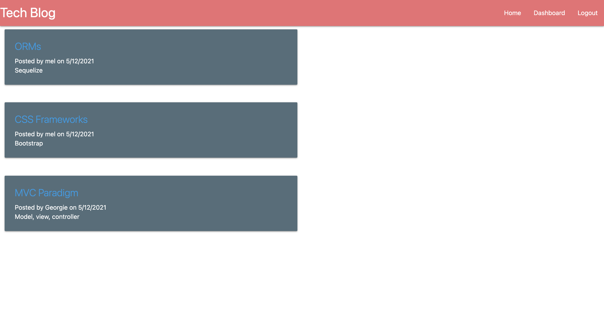

# Tech Blog

This blog allows the user to view existing posts by other users on the homepage when they are logged out. After signing up or logging in, they can then comment on these posts as well. 

From here, the user can also access their dashboard from which they can view, add, edit, and delete their own posts. 

When finished, the user is able to logout. 

To login and view the functionality, please use the following criteria:

    Username: mel@test.com

    Password: password123!

## Contact 

If you wish to contact me you can reach me at melanieuhrich13@gmail.com.

## Screenshot

## Link to Deployed Application

https://shrouded-chamber-94403.herokuapp.com/